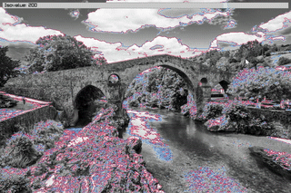
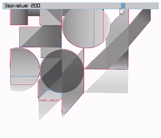

# Marching Squares

A real-time interactive contour visualization tool written in C using raylib.
Load a grayscale image, adjust an isovalue threshold, and watch contour lines
redraw live across the image field.

 \



## Algorithm

### The Grid

The image is treated as a scalar field. Each pixel holds a value in [0, 255].
The algorithm operates on a contouring grid of size (W-1) x (H-1), where each
cell is defined by four neighboring pixel corners: top-left, top-right,
bottom-right, bottom-left.

### Cell Classification

For each cell, the four corner values are compared against the isovalue.
Each corner is assigned 1 if above the threshold, 0 if below. The four bits
form a 4-bit index (0–15), encoding one of 16 possible configurations.

```
bit 3 = top-left
bit 2 = top-right
bit 1 = bottom-right
bit 0 = bottom-left
```

### Lookup Table

A prebuilt lookup table maps each index to zero, one, or two line segments,
described as pairs of edges (TOP, RIGHT, BOTTOM, LEFT). Cases 5 and 10 are
ambiguous — two diagonally opposite corners are active. Both are resolved
with two segments each, favoring a consistent saddle-point convention.

### Linear Interpolation

Rather than placing the contour at the midpoint of each edge, the intersection
is computed via linear interpolation along the edge:

```
mu = (isovalue - v1) / (v2 - v1)
point = p1 + mu * (p2 - p1)
```

This places the contour precisely where the scalar field crosses the threshold,
producing smooth curves even at low resolution.

---

## Interaction

| Input         | Effect                              |
|---------------|-------------------------------------|
| Slider        | Adjust isovalue (0 to 255)          |
| Arrow Up/Down | Increment or decrement isovalue     |
| Space         | Toggle between grayscale and binary threshold view |

---

## Building

Requires raylib and raygui headers in `../include/`.

```sh
make
./marching_squares.exe
```

The image path is hardcoded. To change the source image, edit the
`image_path` variable near the top of `main()`.

---

## Implementation Notes

- Contour segments are stored in a dynamic array that doubles in capacity
  on overflow and resets (without reallocating) each frame.
- Two contour passes run per frame: one at `isovalue`, one at `isovalue + 10`.

---

## References

- Matt Keeter — Contours: https://www.mattkeeter.com/projects/contours/
- Marching Squares on Wikipedia

